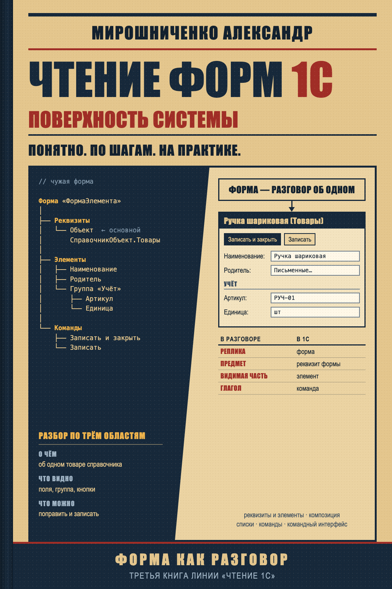

# Чтение форм 1С

Черновик книги о том, как устроен интерфейс 1С и как читать управляемые формы.

---



*(Обложка будет добавлена позже.)*

---

## О проекте

Это **третья книга линии** «Чтение 1С»:

- Книга 1 — **«1С как иностранный язык»** (язык программирования; код).
- Книга 2 — **«Дерево метаданных 1С»** (чертёж системы).
- Книга 3 — **«Чтение форм 1С»** (поверхность системы; *эта книга*).
- Книга 4 — **«Чтение данных. Язык запросов 1С»** (как система отвечает на вопросы).

Главная идея — рассматривать **форму 1С** как разговор системы с пользователем по поводу одного объекта. Метафора разговора держит всю терминологию: форма — реплика; реквизит формы — предмет разговора; элемент — видимая часть реплики; команда — глагол; командный интерфейс — оглавление прикладной программы.

Сквозной сюжет — фирма «Канцтовары». Платформа фиксирована: **1С: Предприятие 8.5**. Режим форм — только управляемые.

Это **не готовый учебник**, а черновик в процессе написания.

---

## Прогресс

**Написано:** § 0.1 и § 0.2 (Модуль 0). Остальное — в работе.

| Модуль | Название | §§ | Статус |
|:------:|----------|:--:|:------:|
| 0 | Что видит пользователь | 8 | 🟡 В работе (§§ 0.1–0.2) |
| 1 | Формы, которые делает платформа сама | 5 | ⬜ Не начат |
| 2 | Анатомия формы | 6 | ⬜ Не начат |
| 3 | Данные формы: реквизиты | 7 | ⬜ Не начат |
| 4 | Связь элемента с данными | 6 | ⬜ Не начат |
| 5 | Композиция формы | 6 | ⬜ Не начат |
| 6 | Списки на форме | 7 | ⬜ Не начат |
| 7 | Глаголы формы: команды и кнопки | 6 | ⬜ Не начат |
| 8 | Командный интерфейс программы | 6 | ⬜ Не начат |
| 9 | Особые виды форм | 7 | ⬜ Не начат |
| 10 | Завершение | 6 | ⬜ Не начат |

**Итого по плану:** 11 модулей, 70 параграфов.

---

## Содержание

### Модуль 0. Что видит пользователь

- [§ 0.1. Платформа в двух режимах: Конфигуратор и Предприятие](chapters/00_vvedenie/00-01_platforma_v_dvuh_rezhimah.md)
- [§ 0.2. Что такое интерфейс пользователя: всё, что видно и трогается](chapters/00_vvedenie/00-02_interfeys_polzovatelya.md)
- § 0.3. Форма как единица интерфейса: разговор о *чём-то одном* — *в работе*
- § 0.4. Командный интерфейс: оглавление прикладной программы
- § 0.5. Клиент и сервер: пользователь здесь, данные там
- § 0.6. Декларативность платформы: «не написать действие, а задать правило»
- § 0.7. Два режима форм: управляемые и обычные
- § 0.8. Связь с метаданными и с кодом

*Структура остальных модулей — в [полном плане книги](docs/00_plan_knigi.md).*

---

## Структура репозитория

```
chapters/
├── 00_vvedenie/             — §§ 0.1–0.8   (Что видит пользователь)
├── 01_avtoformy/            — §§ 1.1–1.5   (Автогенерируемые формы)
├── 02_anatomiya/            — §§ 2.1–2.6   (Анатомия формы)
├── 03_dannye/               — §§ 3.1–3.7   (Данные формы: реквизиты)
├── 04_svyaz_s_dannymi/      — §§ 4.1–4.6   (Связь элемента с данными)
├── 05_kompoziciya/          — §§ 5.1–5.6   (Композиция формы)
├── 06_spiski/               — §§ 6.1–6.7   (Списки на форме)
├── 07_komandy/              — §§ 7.1–7.6   (Команды и кнопки)
├── 08_komandnyy_interfeys/  — §§ 8.1–8.6   (Командный интерфейс)
├── 09_osobye_formy/         — §§ 9.1–9.7   (Особые виды форм)
└── 10_zavershenie/          — §§ 10.1–10.6 (Завершение)

assets/img/                  — обложка и медиафайлы
docs/                        — план книги, статус параграфов
scripts/                     — скрипты рецензирования (DeepSeek, GPT-4.1)
CLAUDE.md                    — рабочие соглашения для работы со мной
```

Каждый параграф — отдельный Markdown-файл. Заголовок модуля генерируется из имени папки при сборке.

---

## Принципы

- **Форма как разговор, а не как набор кнопок.** Объяснение через смысл и роль, а не через свойства.
- **Медленный вход для новичка.** Курс рассчитан на абсолютного новичка без опыта программирования.
- **Платформа 8.5, управляемые формы, никакого кода обработчиков.** Принципиальные границы — см. CLAUDE.md и план.
- **Связь с реальными задачами.** Сквозной пример «Канцтовары» проходит через всю книгу; в Модуле 9 — выход на типовые конфигурации.
- **Качество изложения.** Каждый параграф проходит рецензию (DeepSeek + GPT-4.1).

---

## Для кого

- Новички в платформе 1С, уже умеющие читать код и метаданные (или изучающие их параллельно).
- Аналитики и постановщики, которым нужно «видеть» форму в типовых конфигурациях.
- Разработчики, переходящие с других интерфейсных систем (Web, WinForms) на управляемые формы 1С.

---

## Сборка

По расписанию (02:00 UTC ежедневно) или вручную через GitHub Actions собирается книга в шести форматах. Все файлы именуются с ревизией коммита:

| Файл | Описание |
|------|----------|
| `1c-reading-forms_rev_XXXXXXX.epub` | EPUB для читалок |
| `1c-reading-forms_rev_XXXXXXX.fb2`  | FB2 для читалок |
| `1c-reading-forms_rev_XXXXXXX.pdf`  | PDF (A5, размер из metadata.yaml) |
| `1c-reading-forms_rev_XXXXXXX.html` | HTML — один самодостаточный файл |
| `1c-reading-forms_rev_XXXXXXX.docx` | DOCX стандарт |
| `1c-reading-forms_rev_XXXXXXX_a4.docx` | DOCX A4 (210×297 мм, поля 25/20 мм) |

Готовые файлы появляются в разделе **Releases** как черновые выпуски.

---

## Обратная связь

Замечания, ошибки и предложения приветствуются. Особенно полезны:
- проблемы понимания и неоднозначные формулировки;
- логические разрывы между параграфами;
- неточности в точных названиях вкладок, свойств, команд платформы 8.5.

---

## Лицензия

Пока не определена (предположительно — CC BY-NC-ND, как в первой и второй книгах серии).
